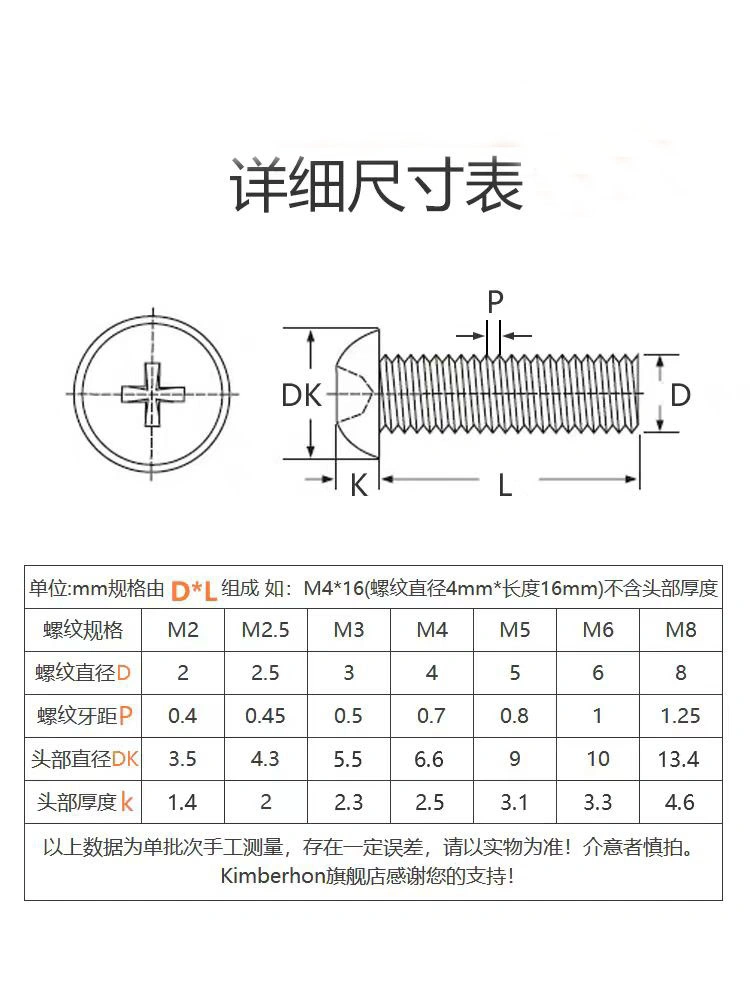
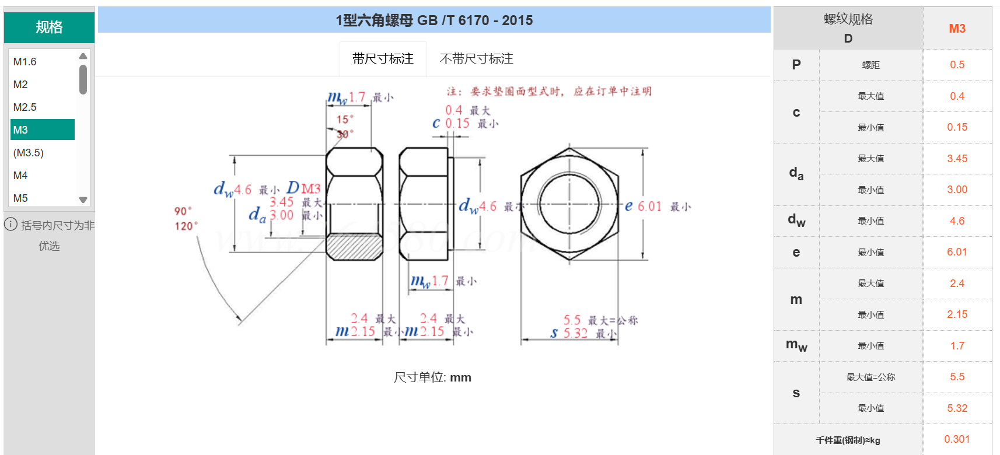

# 3d打印笔记
## 看图
>记录看到的有趣的制作
* 伸缩夹`基本上就是杠杆，但是不是直的杠杆`
* 环形花洒`形状是环形，水是从中间出来的，像洗车一样`
* 布质链甲
* 棘轮发条`像手表一样，会嘎嘎响`

## 作图
* 开启自动投影边以用作参考
* 创建零部件
* 创建草图
  * 创建矩形（两点矩形，输入数值，完成草图）
  * 创建3d矩形`切换视图，拉伸`
  * 确定相对位置（创建-草图尺寸）
  * 批量复制（阵列）
* 掏空一部分（）
* 创建空心圆柱（构造（确定圆心和半径））
  * 创建同心圆（修改-偏移）
* 圆角
* 送到切片软件里（打印机软件）
  * 文件-3d打印

## 学习制作
### 制作第二个
>计划是，打印一个酒杯，用来放置葡萄
测量：直径是2.5，长是3，我希望能卡住，所以是1.2的半径，1.5的长最多，下面就按照1：1：1的设计

* 新建零部件（装配-新建零部件）
* 创建旋转体
  * 插入-画布-选择图片-选择zx面-确定
  * 选中画布，设置尺寸，参考位置
  * 钢笔工具描边（点-样条曲线-拟合）
  * 完成草图
  * 创建-旋转-选择z轴
* 掏空
  * 抽壳，选择方向
  * 分析确定有没有抽壳成功
* 检验-截面分析-观察有没有抽壳成功（左边的眼睛可以关闭）
* 不够的地方用草图，重新加上或者剪掉
* 增加外观
  * 物理材料，
  * 外观（颜色）
* 设计-渲染-渲染

### 制作一颗螺丝
> 就M3 的螺丝和螺母吧，看看能不能打上。
>  螺丝为什么是六边形

* 创建多边形（创建-多边形-外切多边形）
* 切角（选择xz轴-创建-直线画三角形-完成-旋转）
* 复制（构造-中间平面）
* 创建-镜像（特征）
* 打孔（创建-孔-实体化）
>打孔里的M3怎么只有2mm，难道M3指的是螺母的直径
* ok，检查了下，发现要选4mm，外面是把直径看成半径了
* 外观（实体-物理材料）
* 渲染
>螺丝的话，不知道怎么画自攻螺丝

* 我再给它加个盖子
* 以及仿真（也许是）
  * 装配（线性和组合）
  * 构造-运动连接（选择旋转）
>打印出的盖子，没有办法安装，但是螺丝可以连接到金属的螺母上，但是打印的螺母就不够大了，而且没有十字的头
* 我换成孔的螺纹，而不是自己画图出的螺纹

>但是打印出来的螺母，要么大一点，要么小一点装补上。我觉得是需要选择3.5*0.6 的试试看，还不行的话，就算了，会差个两毫米，不行的话，就打印一个大点的，避免误差好了

* 最后一次，3.0*0.35
> 破案了，是自攻和别的螺纹不一样，打印的3.5能比较容易的进入金属件，但是3.0就不太行。估计是精度的问题，不去考虑它了

### 完成一个盒子，门轴的制作
>2.5 x 3 x 2 的一个放螺丝的盒子
关键是轴和卡扣

* 创建一个盒子，但是被切割
  * 草图-拉伸
  * 构造-偏移平面
  * 修改-分割实体
* 创建轴
  * 标注-创建联动尺寸（用来锁定）
  * 打印机不需要支持是45°（视频说的）
  * 拉伸，创建新的实体
* 切割
  * 减去
  * 选中实体，移除不需要的部分
* 旋转
  * 从实体中创建零部件
  * 装配-快速连接-检查问题
* 组装
  * 实体-拖动到零部件中，不知道为什么不可以
  * 我把实体合并，然后单独生成零部件
  * 然后再使用装配，可以决定展开的样子

> 现在放过去验证，看转轴好不好，然后再增加卡扣的功能
> 我还想给debug board打印一些盒子
> 我还想打印一个奶子，但是腰不行了，等下还要整理，先去吃饭

* 尺寸做错了，喷头的精度是0.4mm，下次不要出现几毫米的的了，好歹也做成10mm的精度

### 制作卡扣
* 先做一个盒子出来，相当于复习了前面的内容
* 做了一个缝，但是因为太窄，所以，切片上都看不出来，于是加厚了厚度，希望能够合上，上机打印
>基本上是ok的，但是不好开口和闭合，而且接缝的问题，没有很好的出现

## 实践

### 给开发板制作一个盒子
* 如果是计算厚度+间隙，则使用2+1
* 拉出卡扣（拉伸-角度）
* 切割（合并-切割-选择刀具）
* 增加公差（修改-偏移面）

> 第一版结果出来了，基本上是ok的，出现的问题
1. 没有办法安装，因为我是垂直安装，栏杆部分卡住了上下活动的部分，需要删除掉
2. 充电口部分没有对齐，因为留出的空隙，导致边缘并不是充电口的边缘，也就是边留多了，但是裁剪少了
   1. 要么把边长弄短
   2. 要么把开口留大
3. 因为坐标系是从左往右，导致左边的空间留的大，右边的空间留的小，所以整体偏左，但是右边又被卡住
   1. 左边电阻的位置没有保护好
   2. connecter从右边卡住了PCB
   3. 有一个connecter留的口子不对
4. 上面的开大了，不合适
5. 卡扣扣不住，卡扣画的太小了
6. 误差留的太大了，考虑要不要重画

>修改之后就work了，仍然有一些问题
1. 卡扣使用摩擦力的了，可以，但是有点松，摩擦力小了点
2. 开口没有很好的缝合，所以参数上还要改一改

#### 数据
* 93 x 106，我要给0.5mm的误差
* 厚度是1mm, 向下偏移1mm，向上偏移1.6mm，总的高度要4mm，下2，上2
* 侧面厚度，我要3mm
* 底面厚度，要2mm
* 基本上画完了，测量花了些时间
* 还差一些开孔没有弄，可以先弄底座出来，先打印引擎。后面有空再弄，估计明天就可以画出来了
* 底座已经打印了，留0.5的偏移还是大了一些
  * 下次可以再保守一些
  * x轴的距离是对的，几乎完美，y轴的稍微长一些，不明白
  * 测量的速度需要提升

* 圆角加的太早，影响到了长拉伸，删除掉
* 拉伸一些不合适的尺寸
* 留一个底座，对层数做出设置，让usb底座卡到，不要翘起来

#### 遗留问题
* 有一个边多留出了0.5mm的重叠，不知道为什么，下次要检查
  * 因为发现板子在抖，所以拉伸了
* 忘记给指示灯留出位置了
  * 后面因为别人提出了，所以增加了
* 留出的位置基本ok，可以再优化一部分的位置，比如上下只有1mm，而不是2mm
  * 增加了壁厚0.1，摩擦力增加，使得卡的更紧了
* 下次可以尝试，使用一张图片来弄，而不是用测量的方法
