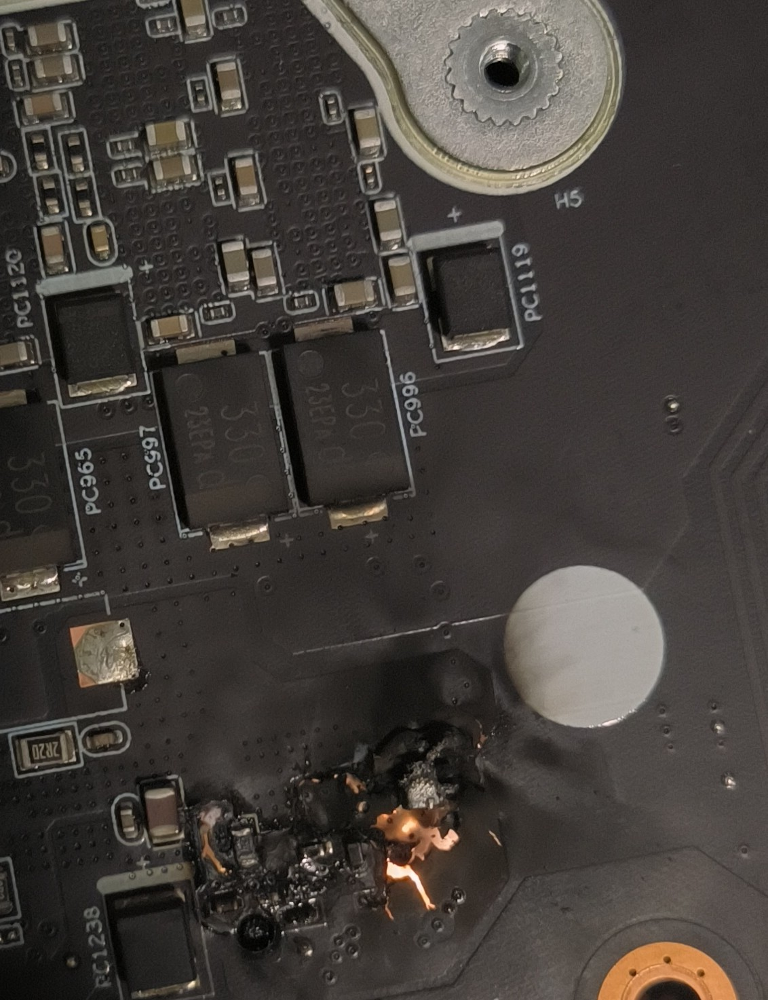

# 坏掉的笔记本电脑
* 看起来是供电部分烧掉
    * 是个三极管周围，烧掉了一大片
    * 铜线很宽, 似乎是个GPU供电的

* 调查分析
    * 前一天在玩博得之门，开始掉帧，就开了性能模式，先前玩荒野大镖客2, 并没有问题
    * 开机，有股异味，拆开，看到明显的击穿迹象
    * 第二天，到售后维修，超过保修期，换主板5k，回收只能500

* lesson learn
    * 击穿大概是因为散热问题，CPU和GPU有温度墙，但是其他元件并没有那么好，主板的温度降不下，所以发生了击穿，等再上电的时候出了问题
    * 笔记本的高度集成，不适合玩游戏，游戏本就是个笑话，办公之外的都不需要笔记本
    * 难以维修，换主板价格太高了