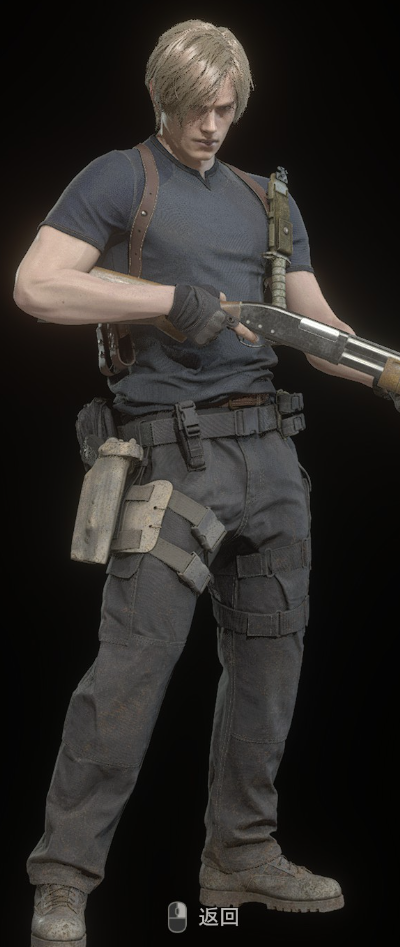

## 基本假设
1. 基本考虑是印象和功能。风格，材质可以作为切入点
2. 只记住什么感觉好和差，至多解析到单品，不去想为什么会产生这种感觉，话题太大聊不明白
3. 服装只是服装≠受主义≠被喜欢，但确实是个颜值社会，颜值在不停的社会交换中很占优

## 风格
* 了解各种风格(给人的感觉)很重要，从地域，从历史找
  * 海滩
  * 刺客
  * 机械风格
  * 街头
  * 西部，牛仔
  * 汉服
  * 农民
  * 运动
  * 小朋友

* 觉得丑是因为知道的太少了
* 从功能上分类
  * 速干
  * 防晒
  * 舒适度
* 从基础材料上

## 游戏实例

* 应该还是一身的肌肉帅，跟穿搭没啥关系
## 衣服收纳