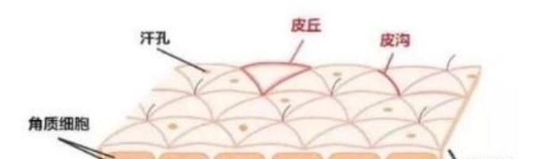

# 外貌研究
**实践补充**
1. 从来没体验过当帅哥的感觉。前同事有：见过两个场景：
    * 快递站有个同龄女生，路上遇到，会向他打招呼。
    * 前新同事(女生)，会主动加他微信，开始查户口(哪里人，多大之类)
    * 但也并没有说要找他处对象
    * ->管理外貌，能降低社交的障碍，更容易接近，让生活更轻松，但也别期待太多

2. 观察别人的外貌 -> 结论：少犯错/不扣分是容易执行的目标
    * 观察操作容易变形，观察人 -> 看漂亮女生 -> 择偶/性压抑
    * 男的好看的真不多，女生好看的眼妆，口红，刮腻子，没研究过的不好学，只粗略的看也分析无法分析。眼妆，口红也不适合男生模仿。
    * 哈耶克的大手筛出来，攻击/欺骗你生存本能的风格(齐b短裙，高跟鞋(强制肌肉线条+身高)，尼龙袜(光滑，反光)...)，为什么会具有吸引力，无法纯靠思索发现，也没有模仿的价值，应对方法是：不解构，不排斥，不理会，就一句：嗯，好看。不需要再多做什么。
    * 观察还是要做：仅观察单品
    * 在观察中瞥见了克苏鲁(整容脸)，再强调不要观察衣物(因为无法学习)，锻炼注意力肌肉，正念练习

3. 避免犯错
    1. 眼镜，就没有好看的，吸引了全部注意力则更糟糕，最好能引导到人身上
    2. 头发，塌的头发就没好看的
    3. 肥胖(Fat)，会丢失脸的轮廓，大饼脸不好看
    4. 皮肤：满脸痘的，真的很难看
    5. 妆造：照镜子多了，有点恐怖谷效应
    6. 身高：只注意看了女生，和平均160数据完全不符(正常分布应是有人矮，有人高)，女生穿增高鞋非常普遍。

## 假设
* 必须卷外貌
    * 如果你不好看，大概率在作息，饮食，劳动(收入/工作氛围/环境)，认知(营养/运动/情绪)上存在问题
    * 人的精力是有限的，以貌取人是最普遍的筛选方式，尤其是原子化社会，为了不被偏见影响务必尊重游戏规则。
    * 外貌因素不是软实力能替代的。没有足够的物质条件(xx二代)，就必须当作重要的课题做。

* 意识和评判
    * 外貌是一定要抠细节`观察猫和狗，只用一笔画出。会发现比例和曲度，差一点就无法分辨`
    * 人眼是一个测量仪器，本身就存在误差，更不用说近视，散光的问题。我不知道这意味着什么，但企图精确的，数值上的因果性是不可能的。    
    * 最重要的是感觉(范儿得正)，感觉对了，做什么都是对的
    * 优先以健康为标准，接受自然的、健康的变化，避免不必要或有风险的整形与过度化妆。

* 怎么做
    * 先找到你喜欢的，认可的风格进行模仿，再加入自己的理解
    * 分解项则求助专业的人`身材：健身， 发型：发廊，牙齿：牙医`
    * 只关注现实里的人，只记住第一眼的印象

## 浏览
* 塑料叉FOKU
* 爱吃火锅
* 小徐先生的

## 皮肤

**素材堆积**
* 皮肤表面不是平整的
    * 角质细胞充盈 -> 补水 + 保湿
    * 色素均匀，亮 -> 防晒/抑制
    * 有弹性 -> 年轻/皱纹
    * 黑色的小块，老年斑，黑头
    * 小突起，皮脂腺增生

* 皮肤类型：干皮，油皮
* 判断是否为敏感肌
    * 容易泛红
    * 洗脸后感觉干燥、紧绷

* 毛周角化：一般在腿上，毛孔位置，是红点。说是需要酸+身体乳
* 护肤品
    * 补水，乳液，乳霜
    * 精华

* 化妆品(需要使用卸妆油)
    * 防晒霜，素颜霜
    * 彩妆

**实践补充**
* 眼周的皮肤薄，离颧骨不远，黑眼圈会特别显眼
* 护肤品真的有用，涂的时候不要糊弄
    * 最开始，偶尔洗脸，脸整体都显黑
    * 随后认真洗脸，洗过会干，使用护肤，但只涂颧骨部分
    * 留长发要戴发箍，认真清洁T区和下颌以及护肤
    * 眼周部分也专门注意

## 脸
### 胡子
* 胡子的清理(无论是手动，还是电动)
    * 清洁
    * 湿润  - 不然会痛 `尽量不要一时兴起就拿起来转`
        * 毛巾/棉柔巾/啫喱覆盖
* 胡青：由基因决定，过重可以用遮瑕和素颜霜
* 胡型：短胡茬short stubble

**实践补充**
1. 因为胡青比较重，且暂时不想使用化妆品 -> 后面再尝试
2. 把胡子当阴影使用，上唇留型，下唇留长度，下颌剃干净(因为偏稀疏)

### 鼻子
* 指甲刀套装里的小剪刀，原来剪毛用的
* 黑头
    * 皮脂分泌旺盛、毛孔堵塞
    * 毛孔管理，皮脂腺过度分泌
        * 疏通、溶解、控制
        * 水杨酸用在停留型产品
        * 护肤

### 牙齿与舌头

**清洁**
* 巴氏刷牙法 + 清理舌苔 `注意感染/异常颜色舌苔的情况(没得过，据说小孩容易有)`
    * 注意牙齿健康，牙龈发炎停止刷牙即时就医
    * 舌苔不清理会有口臭

**外观**
* 清晰的下颌线
    * 牙齿正畸`我有问题，但没做过，手术存在风险。身边统计学，牙齿会松动`
    * 舌头的位置 `Meing`
    * 体脂率
    * 颈阔肌

> 下颌线是网上刷到的名词，没法与美的相关性，有一个健康位置就差不多得了。人类自适应能力挺强，成年后，没出问题就不要动。

### 眉毛
* 突出T区
* 修干净眉毛
    * 眉心宽度等于鼻子的宽度
    * 眉毛上方和眉尾的杂毛修干净

### 头发
* 目前的想法是，先留长，拿着想要的照片，找理发师，问问，找不到什么好资料
* 发质
* 洗护用品
    * 洗发水 `手法`
    * 护发素 `只涂发梢`

* 染发：染发挺伤头发的，可以尝试

### 神态
* 保卫我们的精神状态
* 看镜子观察眼神，想象不同的情绪
    * 好奇，恐惧，防御

## 身材
**健身**
* 健身房务必请私教`竞技赢不代表你对，也许体格优势占很多`
* 健身的方向：减脂，增肌，增加关节灵活性，对应的就是普拉提/心肺耐力，撸铁，松解/拉伸/热身

**实践补充**
* 基础：想练大，最关键的是上重量，其他的都是花里胡哨
* 心态：
    * 不用考虑酸，只要完成动作的质量高(有没有全程/呼吸)，就练到位了
    * 不着急上重量，多次实践后，没有观察到异常情况，才能进行下个阶段
    * 练腿比想象中伤精神，即使腿不酸，意志力/能量会受到影响
* 训练：
    * 动作：有教练帮你看，用小脑学会，同时增强身体感受
    * 呼吸：能掌握好核心稳定下的呼吸，不憋气(增加肌耐力，不做瓦式呼吸)
    * 节奏：快用力，慢慢放，每一个都流畅，不要在组间休息

## 服装
> 脸好看，衣服合体，是最好看的。注意力转移到衣服上的，都不好看。

### 基本假设
1. 基本考虑是印象和功能。风格，材质可以作为切入点
2. 只记住什么感觉好和差，至多解析到单品，不去想为什么会产生这种感觉，话题太大聊不明白 -> 仅比较相似的单品为什么感觉会不一样
3. 服装只是服装≠受注意≠被喜欢，但确实是个颜值社会，颜值在不停的社会交换中很占优

### 了解自己
* 上半身：肩宽，衣长，袖长，胸围
* 下半身：腰围，臀围，裤长，前挡，裤口
* 鞋和增高鞋

### 风格
* 了解各种风格(给人的感觉)很重要，从地域，从历史找
  * 海滩
  * 刺客
  * 机械风格
  * 街头
  * 西部，牛仔
  * 汉服
  * 农民
  * 运动
  * 小朋友

* 觉得丑是因为知道的太少了
* 从功能上分类
  * 速干
  * 防晒
  * 舒适度
* 从基础材料上

### 颜色/款式
* 从黑白开始，最好是纯白开始`不喜欢灰色，灰色属于搅屎棍色，掺杂别的颜色里就去饱和度`
* 层次感，使用饱和度设计

### 衣服清洗 & 收纳
* 注意看衣服上的标签
    * 主要是温度，棉麻类一般是40
  
* 深色衣服和浅色衣服分开清洗

### 游戏实例

* 应该还是一身的肌肉帅，跟穿搭没啥关系

### 实践
* 感觉衣服属于克苏鲁，看久细节，一定会好看，需要一个客观的理解方法
* 先尝试买到合适的身材的衣服
* 目前喜欢去优衣库 & 迪卡侬